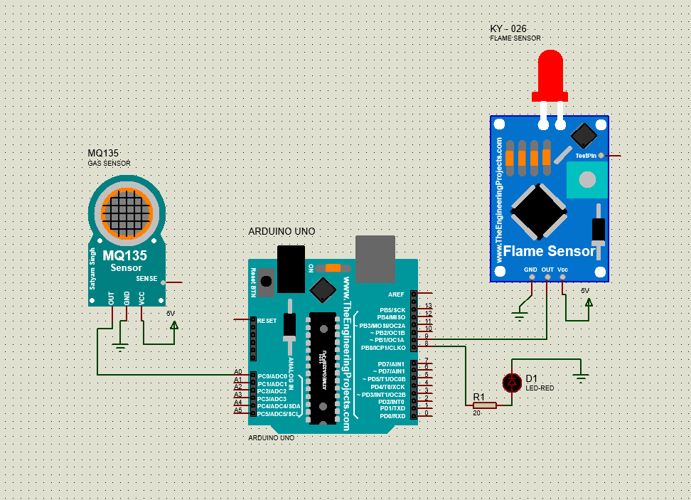

# Fire Detection System Simulation using MQ-135, KY-026, and Arduino Uno

This is a **simulation project** for a fire detection system using Arduino Uno, MQ-135 CO₂ gas sensor, KY-026 flame sensor (IR-based), and an LED indicator. The system monitors CO₂ concentration and infrared radiation to identify potential fire hazards.

**Note:** This project was developed as a conceptual simulation and was not implemented on physical hardware.

---

## Project Overview

Fire incidents can cause serious material damage and endanger lives. This project simulates a detection system that responds to:

- **High CO₂ levels** from combustion, using the MQ-135 sensor
- **Infrared radiation** from flames, using the KY-026 sensor
- **Visual warning** using an LED controlled by the Arduino Uno

---

## Features

- Detection logic based on CO₂ ppm thresholds
- Detection of IR radiation from fire
- LED indicator for fire warning
- Serial output for monitoring sensor data

---

## Components (Simulated)

- Arduino Uno
- MQ-135 Gas Sensor (analog pin A0)
- KY-026 Flame Sensor (digital pin D8)
- LED (digital pin D9)

---

## Wiring Diagram

The following image illustrates the wiring configuration for the simulated system:



---

## System Flow

1. System starts and acquires data from both sensors.
2. If flame is detected **and** CO₂ exceeds 400 ppm, the LED is turned ON.
3. If only flame is detected, LED still turns ON.
4. If no fire or CO₂ level is low, the LED remains OFF.

---

## Functional Logic

```cpp
if (flameDetected && co2Value > 400) {
    // LED ON - Fire + CO2
} else if (flameDetected) {
    // LED ON - Fire only
} else {
    // LED OFF
}
